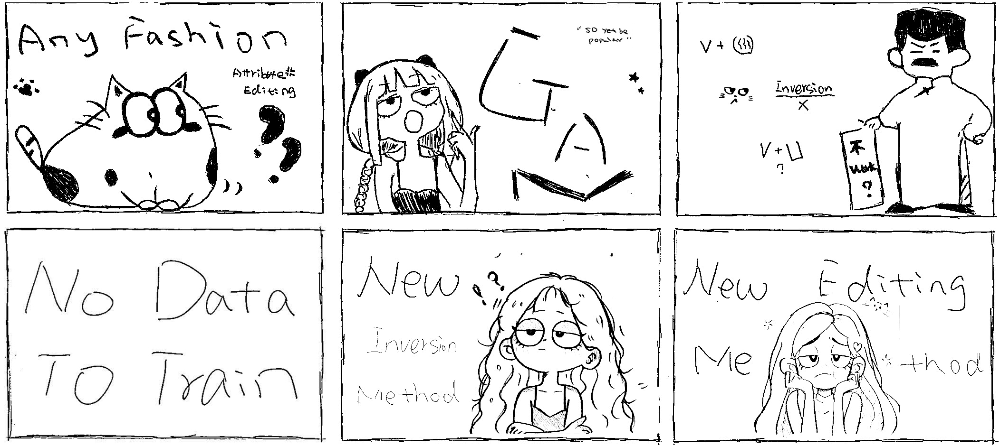
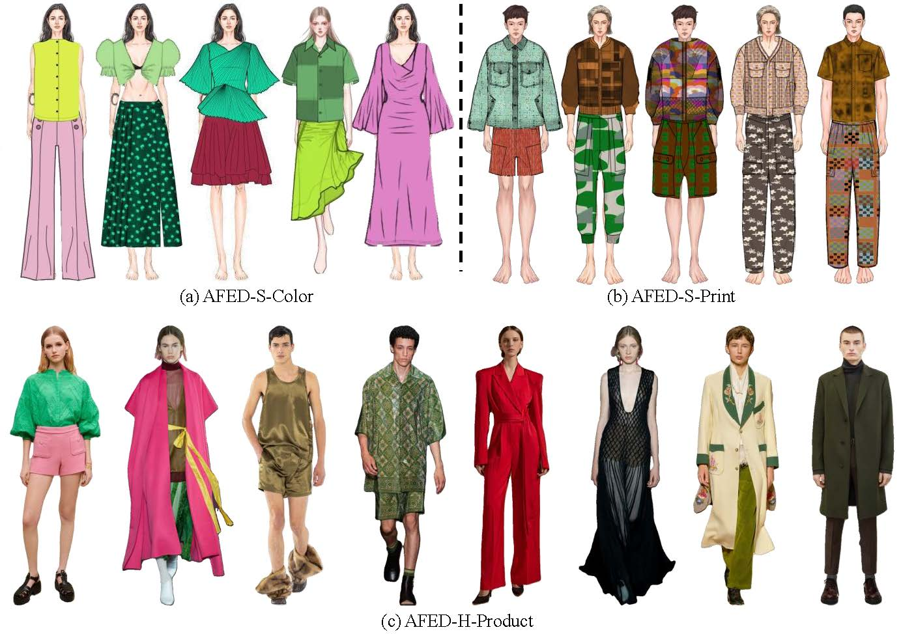

<!-- PROJECT LOGO -->
<p align="center">
  
  <h1 align="center">Any Fashion Attribute Editing: Dataset and Pretrained Models (TPAMI 2025)</h1>
  <p align="center">
    <a href="https://github.com/FST-ZHUSHUMIN/"><strong>Shumin Zhu</strong></a>
    ·    
    <a href="https://github.com/AemikaChow/"><strong>Xingxing Zou</strong></a>
    ·
    <a href="https://github.com/flyywh"><strong>Wenhan Yang</strong></a>
    ·
    <a href="https://www.aidlab.hk/en/people-detail/prof-calvin-wong"><strong>Waikeung Wong</strong></a>
  </p>
  <!-- <h2 align="center">TPAMI 2025</h2> -->

  <div align="center">
    
  </div>

<br />

## Quick View

 <div align="center">
    
  </div>
  
Our **main contributions** are as follows:

$\bullet$ We present the Any Fashion Editing Dataset (AFED), which comprises 830,000 high-quality full-body fashion images from two distinct domains.

$\bullet$ We propose Twin-Net, a GAN-based framework for high-quality fashion image inversion and editing.

$\bullet$ We design PairsPCA, a method capable of consistently mining the clear mapping relationship between latent and semantic meanings. 

<br />

This work focuses on `any' fashion attribute editing: 1) the ability to edit 78 fine-grained design attributes commonly observed in daily life; 2) the capability to modify desired attributes while keeping the rest of the components still; and 3) the flexibility to continuously edit the edited image. Comprehensive experiments, including comparisons with ten state-of-the-art image inversion methods and four editing algorithms, demonstrate the effectiveness of our Twin-Net and editing algorithm.

  <div align="center">
    
  </div>

## Get Started
The environment setting for GAN-based models is a relatively old version compared to the current diffusion model. We have compared our results with numerous baselines and written these codes under various environmental settings at different times, respectively. In the version uploaded, we have organised all the code within a single environment (**CUDA Toolkit version is 11.7, the operating system is 22.04, and the driver version is 570.133.07**) for ease usage. To ensure the code runs smoothly, we recommend following steps, which have been verified to work before uploading. If there are still some bugs, please refer to the original repositories of those baselines.

Quick start:
```
conda create -n twinnet python=3.8.20

conda activate twinnet

conda install pytorch==1.8.0 torchvision==0.9.0 torchaudio==0.8.0 cudatoolkit=11.1 -c pytorch -c conda-forge

pip install matplotlib tensorboard opencv-python imageio
```
<br>

To train:
```
bash train.sh
```
<br>

To test:
```
python inference_pairpca_editing.py rate=0 reconstruction rate>0 editing
```

<br>

Evaluation:
```
bash recon_metrics.sh msssim  lpips mse

bash fid.sh

bash kid.sh
```

## Resources
-【[**Obtain AFED**](https://drive.google.com/drive/folders/1VTY9EseiB9WMNQVnvnYUouHYmbEajVny?usp=sharing)】The AFED dataset consists of three sub-datasets, as illustrated in the Figure below.  It includes 300,000 (a) solid-colour women's clothing sketches (AFED-S-Colour), 300,000 (b) printed men's clothing sketches (AFED-S-Print), and 230,000 (c) human fashion images (AFED-H-Product). For the AFED-S-Colour and AFED-S-Print, the data were generated using a mature pipeline [**AiDA**](https://www.aida.com.hk/), which was previously utilised to create full-body sketch images with fine-grained fashion attributes. Generating these sketches required approximately 250 hours on a single NVIDIA GeForce GTX 3090 GPU. Regarding the AFED-H-Product, we initially collected over 1,000,000 raw fashion images from the internet, encompassing various clothing styles and fine-grained attributes. The manual collection process is hindered by its slow pace and high costs. For reference, a team of four carried out this collection manually over a year, averaging 4,800 images per week.

<div align="center">
    
  </div>

-【[**Pretrained Models**](https://drive.google.com/drive/folders/1xzYaWQ1FZ3Q16Xw6UDS_HEVRp-PQbUth?usp=sharing)】A total of 14 baselines were compared, including seven GAN inversion methods, three diffusion-based editing methods, and four GAN-based attribute editing methods. We trained 27 models across three datasets, comprising StyleGAN models and models for eight GAN inversion methods (including Twin-Net). 

## Citation
```bib

```

## Acknowledgments

This implementation is built based on [StyleGAN2](https://github.com/NVlabs/stylegan2-ada-pytorch), [StyleGAN-Human](https://github.com/stylegan-human/StyleGAN-Human), [encoder4editing](https://github.com/omertov/encoder4editing), [HFGI](https://github.com/Tengfei-Wang/HFGI).

This work is partially supported by the [Laboratory for Artificial Intelligence in Design (AiDLab)](https://www.aidlab.hk/en/)(Project Code: RP3-1), Innovation and Technology Fund, Hong Kong, SAR. This work is also partially supported by a grant from the Research Grants Council of the Hong Kong, SAR(Project No. PolyU/RGC Project PolyU 25211424).

<br>


